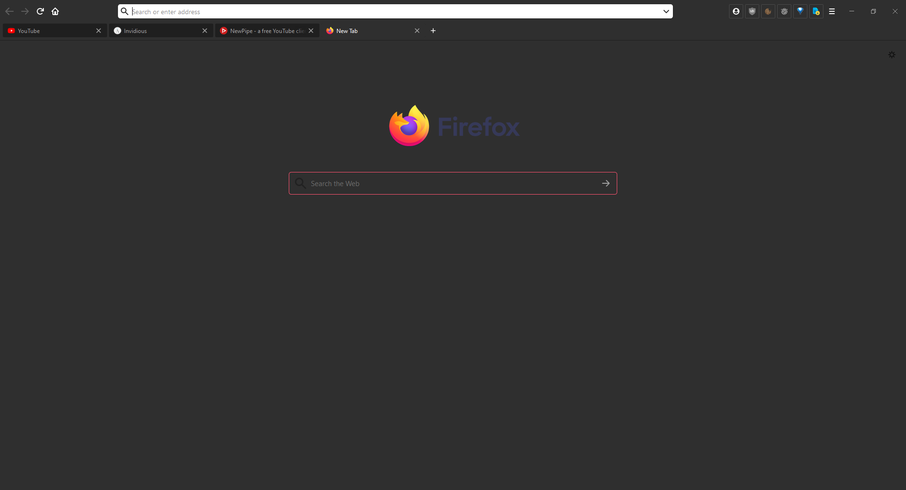

# Firefox CSS 
A dark userstyle for Firefox.
Forked version from [moonlight-userChrome](https://github.com/eduardhojbota/moonlight-userChrome).

## Installation
1. Open your currently active profile folder ( "about:support" -> "Profile Folder" )

2. Create a new folder named chrome

3. Copy the files in the chrome folder

4. If you're running Firefox 69+ make sure to enable 'toolkit.legacyUserProfileCustomizations.stylesheets' in about:config 

## Additional Features

Additional Features are disabled by default but they can be enabled by uncommenting them in userChrome.css.

## Preview

